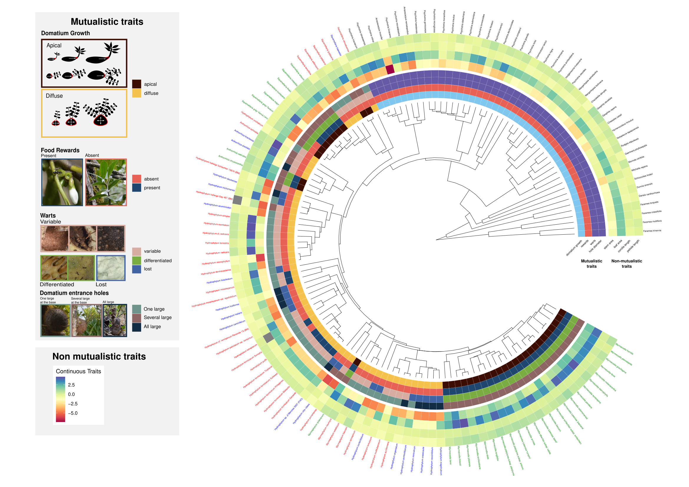

# Mutualisms drive plant trait evolution beyond interaction-related traits

Authors: [Gustavo Burin](mailto:gustavo.burin@nhm.ac.uk), [Laura C. E. Campbell](mailto:laura.campbell@durham.ac.uk), [Susanne S. Renner](mailto:srenner@wustl.edu), [E. Toby Kiers](mailto:toby.kiers@vu.nl), [Guillaume Chomicki](mailto:guillaume.chomicki@durham.ac.uk)

This repository contains all the code and data used in the manuscript.



## Data

* `/data` contains the cleaned data used in the analyses, including the phylogeny (MCC and posterior distribution).

All raw and cleaned data are also available from the [FigShare.com](10.6084/m9.figshare.24466210). 

If you use the cleaned data please cite as follows: 
> Gustavo Burin; Laura C. E. Campbell; Susanne S. Renner; E. Toby Kiers; Guillaume Chomicki (2023). Dataset: "Mutualisms drive plant trait evolution beyond interaction-related traits". FigShare.com. (10.6084/m9.figshare.24466210).

**Please cite the original sources of the data where possible.**

-------
## Analyses
The analysis code is located in the ./R folder, divided into main analysis (`./R/houwie_analysis.R`) and supplementary analyses (`./R/houwie_analysis_posterior.R` and `./R/run_ouwie_climpc.R`). The results are summarized into `.R` files that generate the figures for all plots (both from the main text and the supplementary material), with commented lines to save them as external files. These scripts generate the base elements for the main figures. The results from all analyses are provided into subfolders that follow the same structure as the scripts used to generate them, and other side data and results (e.g. taxonomy check) are made available through `.RDS`. `.xlsx` or `.csv` files.

-------
## Other folders

* `manuscript/figs/final_figs` contains the main figures
* `manuscript/figs/houwie` contains individual figures with the results for the _hOUwie_ analyses

-------
## Session Info

```
R version 4.3.1 (2023-06-16)
Platform: x86_64-pc-linux-gnu (64-bit)
Running under: Manjaro Linux

Matrix products: default
BLAS:   /usr/lib/libblas.so.3.11.0 
LAPACK: /usr/lib/liblapack.so.3.11.0

locale:
 [1] LC_CTYPE=en_GB.utf8        LC_NUMERIC=C              
 [3] LC_TIME=en_GB.UTF-8        LC_COLLATE=en_GB.utf8     
 [5] LC_MONETARY=en_GB.UTF-8    LC_MESSAGES=en_GB.utf8    
 [7] LC_PAPER=en_GB.UTF-8       LC_NAME=C                 
 [9] LC_ADDRESS=C               LC_TELEPHONE=C            
[11] LC_MEASUREMENT=en_GB.UTF-8 LC_IDENTIFICATION=C       

time zone: Europe/London
tzcode source: system (glibc)

attached base packages:
[1] parallel  stats     graphics  grDevices utils     datasets  methods  
[8] base     

other attached packages:
 [1] phylolm_2.6.4      expm_0.999-7       Matrix_1.6-1.1     data.table_1.14.8 
 [5] corHMM_2.8         GenSA_1.1.10.1     caper_1.0.3        mvtnorm_1.2-3     
 [9] MASS_7.3-60        OUwie_2.12         RColorBrewer_1.1-3 geiger_2.0.11     
[13] nloptr_2.0.3       corpcor_1.6.10     doMC_1.3.8         iterators_1.0.14  
[17] foreach_1.5.2      phytools_1.9-16    maps_3.4.1         ape_5.7-1         
[21] here_1.0.1        

loaded via a namespace (and not attached):
 [1] tidyselect_1.2.0        subplex_1.8             viridisLite_0.4.2      
 [4] Rmpfr_0.9-3             dplyr_1.1.3             viridis_0.6.4          
 [7] bitops_1.0-7            optimParallel_1.0-2     RCurl_1.98-1.12        
[10] combinat_0.0-8          digest_0.6.33           lifecycle_1.0.3        
[13] magrittr_2.0.3          compiler_4.3.1          rlang_1.1.1            
[16] tools_4.3.1             igraph_1.5.1            plotrix_3.8-2          
[19] utf8_1.2.3              phangorn_2.11.1         clusterGeneration_1.3.8
[22] interp_1.1-4            mnormt_2.1.1            scatterplot3d_0.3-44   
[25] plyr_1.8.8              numDeriv_2016.8-1.1     nnet_7.3-19            
[28] grid_4.3.1              fansi_1.0.4             colorspace_2.1-0       
[31] future_1.33.0           ggplot2_3.4.3           globals_0.16.2         
[34] scales_1.2.1            cli_3.6.1               generics_0.1.3         
[37] future.apply_1.11.0     reshape2_1.4.4          stringr_1.5.0          
[40] vctrs_0.6.3             jsonlite_1.8.7          listenv_0.9.0          
[43] glue_1.6.2              parallelly_1.36.0       codetools_0.2-19       
[46] stringi_1.7.12          paleotree_3.4.5         gtable_0.3.4           
[49] deldir_1.0-9            quadprog_1.5-8          gmp_0.7-2              
[52] munsell_0.5.0           tibble_3.2.1            pillar_1.9.0           
[55] deSolve_1.38            R6_2.5.1                lhs_1.1.6              
[58] doParallel_1.0.17       rprojroot_2.0.3         lattice_0.21-8         
[61] png_0.1-8               Rcpp_1.0.11             fastmatch_1.1-4        
[64] coda_0.19-4             gridExtra_2.3           nlme_3.1-163           
[67] pkgconfig_2.0.3
```
